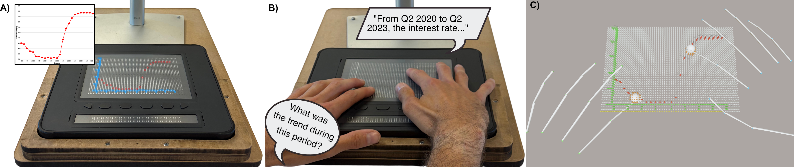
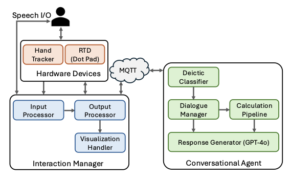

# Feelogue: Reference Implementation



Reference implementation for the paper:

> **Supporting Multimodal Data Interaction on Refreshable Tactile Displays: An Architecture to Combine Touch and Conversational AI**
> Samuel Reinders, Munazza Zaib, Matthew Butler, Bongshin Lee, Ingrid Zukerman, Lizhen Qu, Kim Marriott
>
> PacificVis 2026 - https://doi.org/10.48550/arXiv.2602.15280

The system combines touch input with a conversational AI agent on a refreshable tactile display (RTD), enabling deictic queries that fuse touch context with spoken language. For example, touching two data points and asking *"what is the trend between these points?"*

> **Note:** The initial release of the Interaction Manager will be committed by the end of PacificVis 2026. Stand design files will follow shortly after.

## Architecture



Three components communicate via MQTT:

- **Hardware Devices**: Dot Pad RTD (tactile output, USB serial) + Ultraleap Leap Motion Controller 2 (finger tracking)
- **Interaction Manager** (`interaction-manager/`): Unity C# application. Processes touch and speech input, renders Vega-Lite charts as tactile pin-grid representations, and coordinates multimodal output (tactile, Braille, audio)
- **Conversational Agent** (`agent/`): Python. Classifies intent, resolves deictic references using touch context, and runs a LangChain/GPT-4o calculation pipeline for data queries

## Requirements

**Hardware**
- Dot Pad RTD (connected via USB serial)
- Ultraleap Leap Motion Controller 1 or 2

**Software**
- Unity 2022.3 LTS or later
- Ultraleap Hyperion (for Leap Motion Controller 1 / 2) - must be running on the host machine
- Python 3.10+
- Google Cloud project with Speech-to-Text and Text-to-Speech APIs enabled
- Picovoice Porcupine access key (free tier at console.picovoice.ai)
- MQTT broker (tested with HiveMQ Cloud free tier)
- OpenAI API key

## Setup

**1. Clone and configure environment**

```bash
git clone <repo-url>
cd <repo>
cp .env.example .env
# Fill in .env with your credentials
```

**2. Create Python environment**

```bash
python3 -m venv venv
venv/bin/pip install -r requirements.txt
```

**3. Add credential files to repo root**

- `key-service-account-google.json` - Google Cloud service account key
- `key-porcupine.json` - contains your Porcupine access key and path to your custom wake word model:
  ```json
  {
    "access_key": "your-key-here",
    "keyword_path": "your-wake-word.ppn"
  }
  ```
  Train and download a custom wake word `.ppn` file at [console.picovoice.ai](https://console.picovoice.ai), then place it in `interaction-manager/` (next to `key-porcupine.json`)

**4. Add charts**

A sample chart is included at `interaction-manager/Assets/StreamingAssets/compiled-vl-interestrates-line-new.json` (Australian interest rates, 2019-2025). To add your own, place compiled Vega-Lite JSON files (named `compiled-vl-{chartType}-{dataName}-new.json`) into `interaction-manager/Assets/StreamingAssets/`, or use the in-app file importer at runtime.

**5. Open Unity project**

Open `interaction-manager/` in Unity.

**6. Run the agent**

```bash
source venv/bin/activate
pip install -r requirements.txt
jupyter notebook
```

Open `agent.ipynb` in the browser and run the cells.

**7. Run the Interaction Manager**

Ensure the Ultraleap Hand Tracking software is running, then press **Play** in the Unity Editor (or build and run the application).
